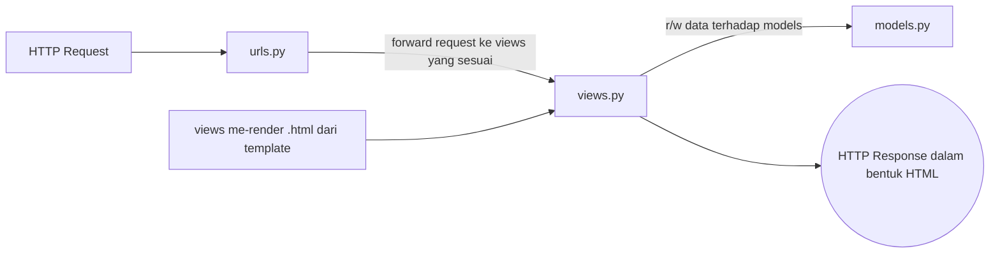

> Graph dibuat dengan bantuan mermaid with [StackEdit](https://stackedit.io/).


> arrow ke models.py sebenarnya bidirectional

**narrative explanation**:
http request yang dikirim oleh user akan ditangani oleh URLS pada django, di mana responsenya berupa HTML. Hal tersebut diproses oleh VIEWS yang akan merender html dari template. Data-data yang akan ditampilkan/diubah, diproses oleh MODELS.

**Virtual Environment**
Proyek Django disarankan untuk dibuat pada sebuah virtual environment agar terisolasi, modul ataupun library yang dibutuhkan agar tidak tercampur-campur. Kita tetap bisa membuat proyek django tanpa virtual environment

```
>> Kita buat function yang menerima parameter request
yang kemudian akan merender html dari template, dalam
hal ini katalog.html

>> Buat pattern url untuk app katalog di urls.py app 
kemudian daftarkan pada urls.py project

>>Data akan dimapping, gunakan sintaks 
khusus tags and filters di file template. Pada fungsi
di views, tambahkan juga parameter context yang isinya
object dari models.py

>>untuk deployment pastikan kita punya
 berkas Procfile dan dpl.yml pada direktori yang tepat
 periksa settings.py.
 Tambahkan API Key dari github account ke Heroku
 pada Github Actions, tambahkan variabel repository secret
 Deploy pada Heroku, ikuti langkah yang disediakan
 oleh UI nya.
```

>Yan


