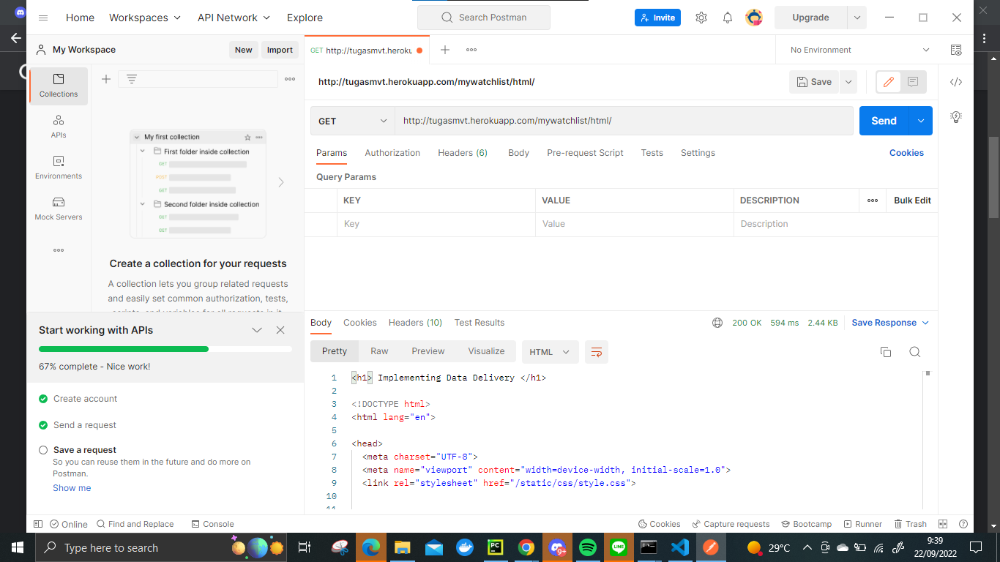
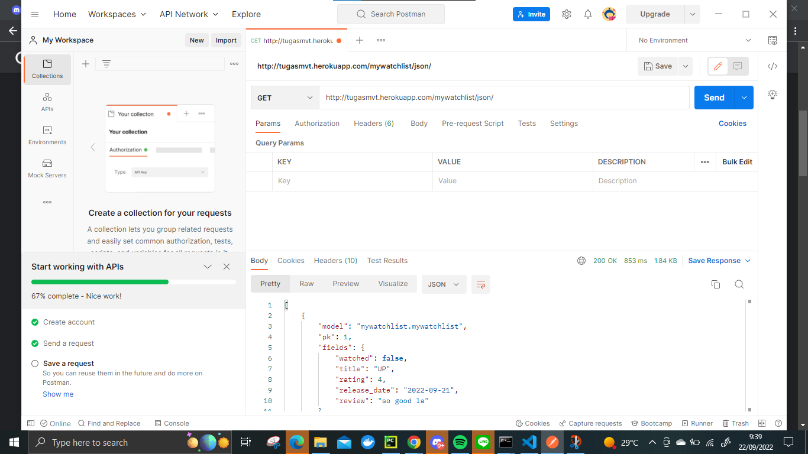
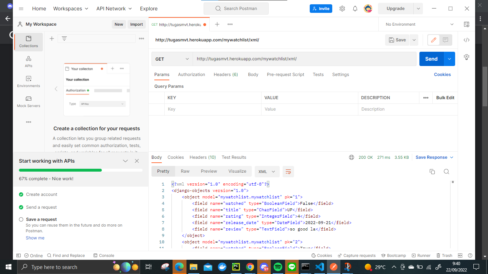

[LINK](https://tugasmvt.herokuapp.com/mywatchlist)

| **JSON**                     | **XML**                                                          | **HTML**                         |
|------------------------------|------------------------------------------------------------------|----------------------------------|
| Javscript Object Notation    | Extended Markup Language                                         | Hypertext Markup Language        |
| Cara merepresentasikan objek | Markup Language dan menggunakan tag untuk merepresentasikan data | Digunakan untuk membuat web page |
| lebih cepat untuk read/write | lebih lambat untuk read-write                                    | -                                |
| Tidak ada end-tag            | ada start dan end tag                                            | ada start dan end tag            |

:sparkles: Data delivery dibutuhkan dalam pengimplementasian suatu platform agar data yang ada dapat direpresentasikan. 
Secara sederhana, agar back-end dapat menyuplai front-end yang akan menyajikan data.

:sparkles: Saya mengikuti tugas dan tutorial sebelumnya untuk memudahkan pemenuhan checklist tersebut.
Untuk penyajian dalam bentuk html, xml, dan json. Saya simpan data yang ada dalam bentuk json.
Lalu gunakan fungsi serializers dari Django untuk serialize menjadi xml dalam suatu fungsi di views yang menerima parameter request
Setelah itu, set up url pattern yang sesuai pada urls.py app.

**SCREENSHOOTS**

